# 会议需求完整清单

## 1. 经营数据查询与分析

| 编号 | 需求 | 说明 |
|---|---|---|
| D01 | 自然语言查经营数据 | 管理层可以直接问：“保利店最近一周销售趋势怎么样？”“本月堂食和外卖哪个更好？” |
| D02 | 支持多层级查询 | 支持总公司、区域、门店、档口/部门、菜品等不同颗粒度。 |
| D03 | 支持多时间维度 | 支持日、周、月、指定时间段、去年同期、上周/上月环比等。 |
| D04 | 经营总览 overview | 一眼看到公司或门店的综合经营情况，而不是一堆零散数字。 |
| D05 | 趋势图展示 | 用图展示销售趋势、堂食/外卖趋势、档口趋势、菜品趋势。 |
| D06 | 向下穿透分析 | 从公司看到区域，从区域看到门店，从门店看到菜品。 |
| D07 | 多门店对比 | 比较不同门店的销售、客流、客单价、满意度、复购、新客占比等。 |
| D08 | 同比/环比分析 | 和去年同期、上周、上月等进行对比。 |
| D09 | 加工后的日报/周报 | 不再让员工手抄静态数字，而是展示趋势、异常、评价和建议。 |
| D10 | 周一自动生成上周经营简报 | 开会前所有人看到同一份数据，把会议时间留给解释原因和确定动作。 |
| D11 | 异常提醒 | 当销售额、客流、菜品销量等出现明显上升或下降时主动提醒。 |
| D12 | 数据背后的业务解释 | AI 不只说“高了/低了”，还要知道数字对应的经营动作。 |
| D13 | 经营原因线索 | 帮助管理层从数据里找可能原因，但最终由人确认。 |
| D14 | 经营动作建议 | 根据数据建议菜单调整、人员跟进、促销复盘、订货调整等动作。 |

## 2. 数据来源与数据整合

补充边界：美团、沃才等第三方平台的数据库通常不开放，不应默认可以用 API、CLI 或其他低成本程序化方式直接读取。第一阶段的数据来源应以员工手动下载、复制、截图，或通用智能体通过网页/软件界面模拟人工点击下载为主。

| 编号 | 需求 | 说明 |
|---|---|---|
| S01 | 美团收银数据获取 | 销售额、订单、堂食/外卖、菜品等数据；优先通过人工导出或智能体代操作后台获取。 |
| S02 | 沃才/供应链数据获取 | 原材料、订货、验收、库存、成本等；不默认有开放接口。 |
| S03 | 会员消费数据获取 | 会员消费、复购、新老客等；注意脱敏和权限。 |
| S04 | 美团/大众点评评价获取 | 好评、差评、口味、服务、环境、食材等分类；可复制、导出或由智能体代操作。 |
| S05 | 成本数据整理 | 菜品成本、门店成本、毛利等，先从导出文件和内部表格整理。 |
| S06 | 能耗数据整理 | 水电燃气等经营能耗，优先从账单、表格、截图等资料整理。 |
| S07 | 人效数据整理 | 人员效率、人力成本、排班相关指标。 |
| S08 | 宿舍管理数据查询 | 会议中提到可查询宿舍管理等内部数据。 |
| S09 | 历史特殊事件记录 | 如闭店、装修、摆大排档、特殊促销等，需要被系统记住。 |
| S10 | 节假日/天气等外部信息 | 可用于订货、预测和复盘，但展示口径要谨慎。 |
| S11 | 数据下载流程 | 员工按固定路径下载，或让通用智能体模拟人工操作网页/软件下载，减少重复劳动。 |
| S12 | 本地数据库/本地文件夹 | 让 AI 每次需要数据时去本地找，而不是指望模型“自己记住”。 |

## 3. 会议效率与管理汇报

| 编号 | 需求 | 说明 |
|---|---|---|
| M01 | 会前数据自动对齐 | 会前所有管理人员看到同一份图和结论。 |
| M02 | 开会不再念数据 | 员工不用在会上口头汇报一堆数字，只解释原因和行动。 |
| M03 | 管理层精力转向改进 | 会议重点从“发生了什么”转向“为什么”和“怎么改”。 |
| M04 | 自动生成汇报材料 | 周报、月报、复盘、图表和简要解释自动生成。 |
| M05 | 会议纪要自动整理 | 会议录音/文字自动变成纪要、待办、结论。 |
| M06 | 高管经验沉淀 | 把老板和高管反复讲的经营理念沉淀成课件、案例、知识库。 |
| M07 | 可搜索会议知识库 | 输入关键词即可找到“谁在什么时候说过什么”。 |
| M08 | 缩短会议时间 | 通过提前整理数据和材料，减少重复讲解。 |

## 4. 菜单、菜品与顾客反馈

| 编号 | 需求 | 说明 |
|---|---|---|
| P01 | 5A 菜单自动分析 | 根据销量、毛利、评价等规则自动形成菜品分类和调整建议。 |
| P02 | 菜品好坏定量判断 | 不靠“感觉好卖”，而是用销量、周期、门店对比等数据判断。 |
| P03 | 菜品结构优化 | 找出明星菜、引流菜、低效菜、需改进菜。 |
| P04 | 顾客评价分类 | 把差评分成服务、口味、食材、环境等类型。 |
| P05 | 好评/差评趋势 | 看某个门店、区域、公司整体的评价变化。 |
| P06 | 菜品与评价关联 | 识别哪些菜品经常被夸、哪些菜品经常被投诉。 |
| P07 | 点餐助手/餐桌 AI 伙伴 | 顾客通过自然对话获得推荐，提高点餐成功率。 |
| P08 | 组合推荐 | 结合优惠、人数、口味和餐厅利益做菜品组合推荐。 |
| P09 | 上菜顺序优化 | 根据菜品、桌台和后厨节奏安排更合理的上菜顺序。 |
| P10 | 顾客反馈处理 | 就餐后反馈自动收集、分类、提醒门店处理。 |

## 5. 门店运营与现场管理

| 编号 | 需求 | 说明 |
|---|---|---|
| O01 | 出品管理 | 通过软件或 AI 指导员工操作、检查结果。 |
| O02 | 服务管理 | 识别服务问题，沉淀标准话术和处理流程。 |
| O03 | 卫生管理 | 对门店卫生检查进行记录、提醒和结果追踪。 |
| O04 | 供应链验收 | 通过图片、摄像头等判断原材料数量和质量。 |
| O05 | 物资供应管理 | 原材料、一次性用品等物资的供应和验收。 |
| O06 | 销售预测 | 根据历史数据和多种因素预测销售额。 |
| O07 | 出品预测 | 根据销售预测推算菜品需求。 |
| O08 | 订货/物料预测 | 根据菜品预测推算原材料需求。 |
| O09 | 成本分析 | 供应链、菜品、门店成本分析。 |
| O10 | 审批流程自动化 | 常规审批按制度自动处理，特殊情况人工处理。 |
| O11 | 绩效数据自动统计 | 群消息、日报、任务完成情况可进入绩效参考。 |

## 6. 群消息与任务跟进

| 编号 | 需求 | 说明 |
|---|---|---|
| G01 | 群消息自动查看 | 多个门店群、运营群的信息由 AI 帮忙看。 |
| G02 | 每日群简报 | 总结当天各群发生了什么、哪些重要、哪些紧急。 |
| G03 | 任务识别 | 从群消息中识别“谁需要做什么”。 |
| G04 | 未回复提醒 | 某件事没人回复时，自动提醒负责人。 |
| G05 | 转办负责人 | 把问题转给对应负责人处理。 |
| G06 | 超时升级 | 一直没人处理时提醒上级。 |
| G07 | 语气/紧急程度判断 | 通过消息内容和语气判断紧急程度。 |
| G08 | 日报/抖音/任务完成统计 | 自动统计日报有没有写、抖音任务有没有完成等。 |

## 7. 市场、促销与品牌内容

| 编号 | 需求 | 说明 |
|---|---|---|
| A01 | 促销活动复盘 | 推广通、抖音等活动之后复盘效果。 |
| A02 | 抖音引流分析 | 分析抖音内容、团购、门店引流效果。 |
| A03 | 新品/季节产品建议 | 根据数据和市场趋势辅助推出新品。 |
| A04 | 品牌故事内容生成 | 把创业故事、品牌理念转化为海报、PPT、门店物料。 |
| A05 | 多智能体方案竞争 | 同一任务可让不同通用智能体分别出方案，再由人选择。 |
| A06 | 图片/PPT/海报生成 | 用 AI 生成宣传图、门店展示图、活动 PPT。 |

## 8. 选址与开店

| 编号 | 需求 | 说明 |
|---|---|---|
| L01 | 选址分析工具 | 形成可用版本，辅助新店选址。 |
| L02 | 地铁沿线优先 | 会议中提到优先考虑地铁站沿线。 |
| L03 | 竞争对手分析 | 看周边是否有主要竞争对手。 |
| L04 | 人群数据分析 | 看周边客群结构、人流、消费能力。 |
| L05 | 外卖数据分析 | 看区域外卖需求和竞争情况。 |
| L06 | 发展潜力分析 | 看未来地铁、商圈、区域发展变化。 |
| L07 | 选址案例报告 | 用案例方式展示 AI 如何辅助判断。 |

## 9. AI 部署、安全与使用方式

| 编号 | 需求 | 说明 |
|---|---|---|
| T01 | 私有部署/私域 AI | 经营数据不能随便放到公域模型里。 |
| T02 | 数据保密 | 营业额、成本、会员、供应链等内部数据需保护。 |
| T03 | 小模型/本地模型可行性 | 对部分任务可考虑私域小模型。 |
| T04 | 公域模型与私域数据分工 | 公域模型可做通用知识、文案、培训；私域数据要谨慎处理。 |
| T05 | 工具组合 | 通用智能体、类小龙虾工具、表格和文档工具各做擅长的部分，最后组合成工作流。 |
| T06 | 标准任务脚本化 | 像 5A 菜单、固定报表这类任务可变成脚本，减少 AI 推理成本。 |
| T07 | 复杂任务交给 AI 思考 | 经营分析、选址、培训内容等需要模型参与判断。 |
| T08 | 员工 AI 使用培训 | 教大家怎样提问、怎样给背景、怎样检查答案。 |

## 10. 需求关系图

```mermaid
flowchart TB
    R["AI 提效需求"]

    R --> A["经营数据"]
    A --> A1["自然语言查询"]
    A --> A2["趋势图"]
    A --> A3["同比环比"]
    A --> A4["异常提醒"]
    A --> A5["周报月报"]

    R --> B["门店运营"]
    B --> B1["出品"]
    B --> B2["服务"]
    B --> B3["卫生"]
    B --> B4["供应链验收"]
    B --> B5["审批"]

    R --> C["菜单与顾客"]
    C --> C1["5A 菜单"]
    C --> C2["点餐助手"]
    C --> C3["评价分类"]
    C --> C4["组合推荐"]

    R --> D["群消息"]
    D --> D1["简报"]
    D --> D2["转办"]
    D --> D3["提醒"]
    D --> D4["绩效统计"]

    R --> E["管理知识"]
    E --> E1["会议纪要"]
    E --> E2["培训课件"]
    E --> E3["经验沉淀"]
    E --> E4["数字人"]

    R --> F["选址开店"]
    F --> F1["地铁"]
    F --> F2["竞品"]
    F --> F3["人群"]
    F --> F4["潜力"]
```

