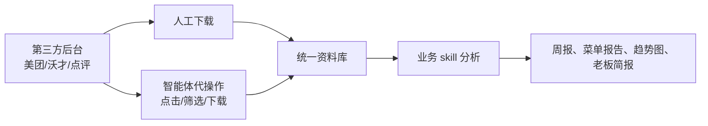
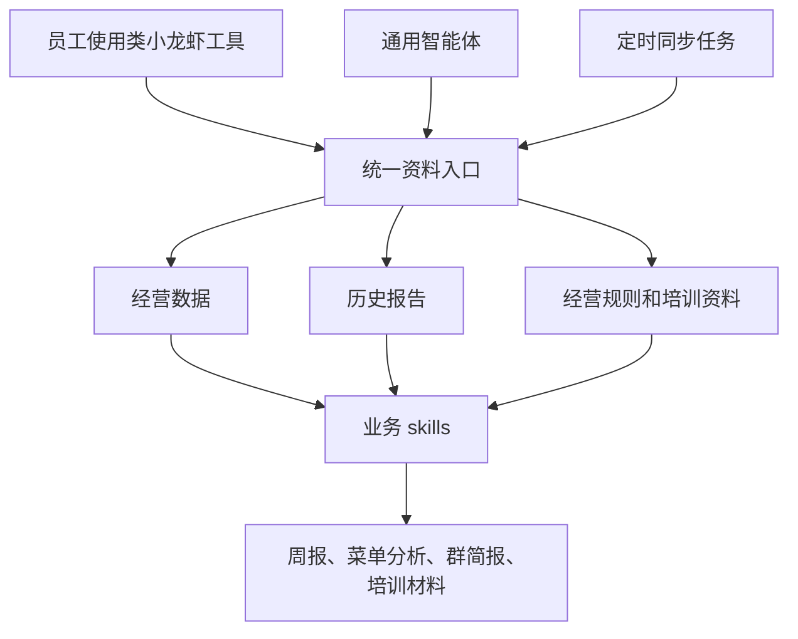
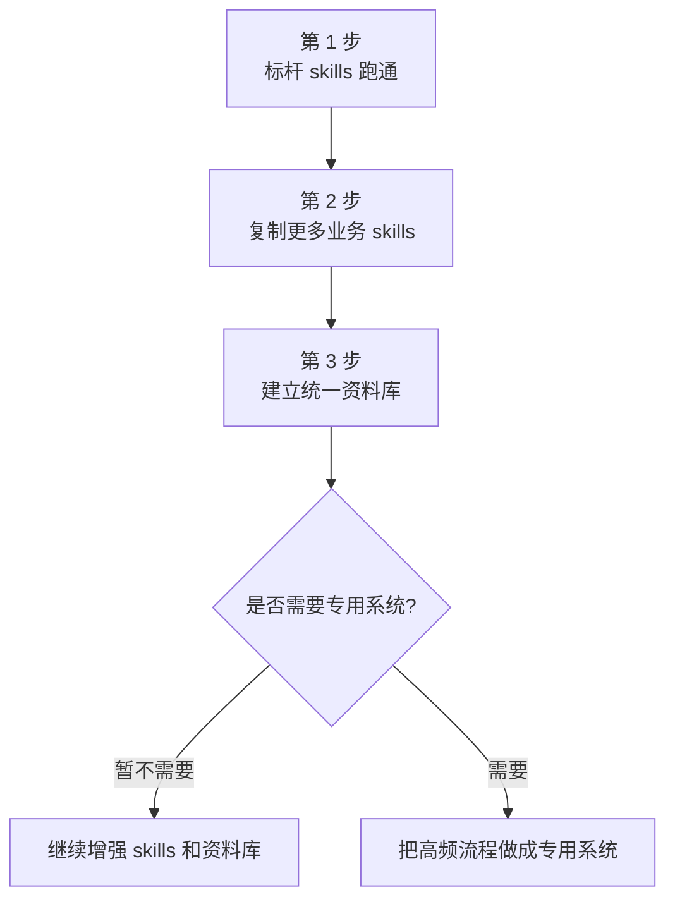

# AI 提效落地方案

本文档给麦家小馆管理层和业务骨干看，重点不是介绍技术，而是说明：**先从哪里做，多久能见效，企业需要配合什么，为什么不建议一开始就做一个大系统。**

建议先走第一条路线：**类小龙虾工具 + 业务 skills + 统一资料库**。这条路线 1-2 周就能看到效果，也更适合餐饮企业目前的真实工作方式。

## 1. 共同前提：先把数据拿到，再让 AI 分析

美团、沃才、点评等第三方平台的数据很重要，但这些平台的底层数据库通常不直接开放给企业使用。也就是说，不能默认“系统直接连上美团数据库，自动拿到所有数据”。

更现实的做法是：

| 数据动作 | 推荐做法 |
|---|---|
| 从美团/沃才后台拿经营数据 | 员工手动下载，或让智能体在授权电脑上像人一样点击、筛选、下载。 |
| 从点评/美团拿顾客评价 | 复制、导出、截图，或让智能体代操作。 |
| 下载后的处理 | 放到统一文件夹或资料库，由 skill 自动清洗、计算、出图、写报告。 |
| 账号密码 | 不交给公域 AI；需要代操作时，只在授权电脑和受控流程内完成。 |

所以本项目真正要先自动化的，不是“硬连第三方数据库”，而是：

1. 固化下载路径和存储地址（统一存储 方便各个员工的智能体获取统一信息。）。
2. 固化文件命名和存放规则。
3. 把下载、点击、同步这些重复操作也做成 skill，让智能体可以自己执行。
4. 定时启动同步任务，例如每天营业结束后，智能体批量下载/同步最新美团数据。
5. 用业务 skill 自动生成报表、图表、趋势图和管理建议。

## 2. 方案一：类小龙虾工具 + skills

### 2.1 这个方案是什么

员工不用等一个大系统上线，而是直接使用类小龙虾工具调用一个个明确的 skill。每个 skill 解决一个具体问题。

员工的体验可以像这样：

```text
/菜单分析 帮我分析过去三个月的菜品毛利
/经营诊断 帮我分析过去30天门店经营情况
/老板简报 生成本周经营一页纸
/群消息简报 汇总昨天运营群里的待办和风险
```

这条路线的好处是：**任务越具体，越容易稳定交付。** 先把菜单分析、经营诊断、周报、群消息简报这类高频工作做扎实，比先做一个大而全系统更快看到结果。

### 2.2 已有基础

目前已经有两个标杆 skill，可以直接作为第一批样板：

| skill | 解决什么问题 | 产出 |
|---|---|---|
| `maijia-menu-analyse` | 菜单/菜品毛利分析 | 菜单分析 Excel，包含总览、价格区间、毛利区间、完整菜品清单 |
| `maijia-business-analyse` | 门店经营诊断 | 经营诊断 HTML 报告、可继续复用的数据表、摘要信息 |

这两个样板的价值不在于“功能很多”，而在于它们已经把一件事跑通了：**从指定后台下载指定报表，按固定规则分析，输出管理层能看的报告。**

### 2.3 1-2 周怎么落地

| 时间 | 动作 | 产出 |
|---|---|---|
| 第 1-2 天 | 选 2-3 个真实场景：菜单分析、经营诊断、老板简报 | 场景清单和样本数据 |
| 第 3-4 天 | 固化数据下载流程，包括人工下载和智能体代操作两种方式 | 下载 SOP、文件夹结构、代操作说明 |
| 第 5-7 天 | 在类小龙虾工具里跑通两个标杆 skill | 菜单分析报告、经营诊断报告 |
| 第 8-10 天 | 根据管理层反馈修改报告口径 | 麦家版报告模板 |
| 第 11-14 天 | 培训 3-5 名中高层/运营骨干自己使用 | 可复用 skill 使用手册 |

这里要强调：下载数据这件事本身也可以继续自动化。第一步可以让员工手动下载；第二步可以让智能体自己打开网页、点击、筛选、下载；第三步可以定时启动，让智能体每天或每周自动同步最新数据。



### 2.4 可以快速沉淀的新 skills

| 新 skill | 输入 | 输出 | 价值 |
|---|---|---|---|
| 门店周报/月报 | 美团经营数据 | 门店趋势、同比环比、异常点、下周动作 | 替代人工念数字 |
| 老板一页纸 | 经营事实表 | 5 个关键结论和下一步动作 | 会前统一视角 |
| 渠道质量分析 | 堂食/外卖/自提数据 | 渠道收入、客单、折扣、退款 | 找渠道问题 |
| 折扣治理 | 优惠金额、收入、订单 | 高折扣门店、高折扣渠道、可回收折扣池 | 控制无效让利 |
| 餐段机会分析 | 时段/餐段数据 | 午餐、晚餐、夜宵机会 | 指导运营动作 |
| 会员渗透分析 | 会员消费数据 | 会员收入占比、会员客单、弱门店 | 提升复购 |
| 顾客评价分析 | 点评/美团评价 | 口味、服务、环境、食材等分类 | 快速发现问题 |
| 群消息简报 | 企业微信群消息 | 待办、未回复、风险、超时升级 | 防止问题漏掉 |

## 3. 企业微信群信息读取

企业微信群里每天会产生大量经营信息、门店问题和待办事项。通用智能体是可以读取企业微信信息的，但前提是企业允许、管理员完成配置，并且符合员工知情和企业合规要求。

建议分两步做：

| 阶段 | 做法 | 结果 |
|---|---|---|
| 半自动阶段 | 让智能体在授权电脑上读取企业微信客户端/网页中的群消息，或使用企业微信开放能力接入 | 减少人工复制 |
| 定时同步阶段 | 每天固定时间同步群消息，自动识别待办、未回复事项、风险问题 | 形成运营风险简报 |

企业微信也有官方开放能力，例如会话内容存档等能力。根据企业微信帮助页面和相关开发资料，使用这类能力通常需要管理员开通、授权和技术配置；是否产生额外费用，要以企业当前版本和企业微信后台实际提示为准。本文档不把“付费”作为默认前提，只把“需要企业授权和配置”作为前提。

## 4. 统一资料库：让方案一也能系统化

类小龙虾工具不是零散小工具。只要维护好一个统一资料库，它同样可以长成企业经营中枢。

这个统一资料库可以先很简单：

- 所有下载的数据放在统一位置。
- 所有报告按门店、日期、类型归档。
- 每次报告记录数据来源、日期范围、生成时间、负责人。
- 员工的智能体可以从统一位置获取数据，也可以把新报告放回统一位置。
- 企业自己的经营规则、菜单规则、会议结论、培训材料逐步沉淀进去。



这里的“统一资料入口”可以理解为：企业所有智能体都从同一个地方拿资料、交回资料，避免数据散落在每个人电脑里。

## 5. 方案二：专用智能体系统

### 5.1 这个方案是什么

专用智能体系统，就是给企业做一个自己的网页系统。员工登录后，可以上传文件、提问、查看报告、下载图表和数据。

这种方式的好处是统一、规范、容易管理；问题是建设周期长。它不是“把聊天框做出来”就结束了，而是要做成一个企业多人能放心使用的系统。

### 5.2 为什么至少需要 2-3 个月

一个能给企业员工使用的专用系统，至少要补齐这些能力：

| 能力 | 企业能理解的含义 |
|---|---|
| 用户管理 | 谁能登录，谁离职后不能再登录，谁是管理员。 |
| 权限管理 | 老板、区域经理、店长、财务看到的数据范围不同。 |
| 文件管理 | 上传的文件放在哪里，谁能看，多久过期，能不能追溯。 |
| 数据处理 | 大文件、坏文件、重复文件都要能处理，不能一出错就卡住。 |
| 报告中心 | 历史报告能查，生成过程能追溯，结果能下载。 |
| 上线部署 | 系统要有稳定网址、稳定服务器、备份、日志和故障处理。 |
| 安全合规 | 营业额、成本、会员、员工信息不能随意泄露。 |

这些工作对使用者来说几乎不可见，但少了任何一块，系统都很难放心给多人使用（会导致巨大的token账单，会导致严重的隐私泄露，会导致员工工作被误导，后果很严重）。

### 5.3 专用智能体建设路线

以下按一个工程师推进估算，不是承诺工期，而是用于判断投入量级。现有原型本身基本可用，不需要花很多天“调通服务”；真正的问题是能力边界很窄，目前主要是上传文件、提问、生成简单图表/数据结果。企业每增加一个新功能，通常都要单独设计、开发、调试，简单功能也常需要 1-3 天。

| 时间 | 重点 | 可交付结果 | 如果不做，会有什么风险/问题 |
|---|---|---|---|
| 第 1-3 天 | 确认现有原型可运行，盘点已有能力和缺口 | 明确“现在能做什么、不能做什么” | 容易误以为系统已经接近可用，后续预期失控。 |
| 第 4-15 天 | 补强登录和数据隔离 | 不同账号不能互相看到数据 | 员工可能看到不该看的营业额、成本或其他门店数据。 |
| 第 16-30 天 | 增加企业、门店、角色 | 支持老板、运营、门店经理等基础角色 | 所有人权限混在一起，无法按组织结构管理数据。 |
| 第 31-45 天 | 完善文件存储 | 文件能安全保存、下载、归档 | 文件散落、丢失、误删，历史报告无法追溯。 |
| 第 46-60 天 | 增加后台任务 | 大文件处理不阻塞，失败能重试 | 上传大文件时系统卡住，失败后不知道原因，也不能自动恢复。 |
| 第 61-80 天 | 扩展数据格式和报告模板 | 更稳定支持经营表格，生成标准报告 | 每来一种新表都要临时处理，报告口径不稳定。 |
| 第 81-95 天 | 完善员工工作台 | 报告中心、文件中心、权限可见性 | 员工找不到历史报告，不知道哪些文件能用。 |
| 第 96-110 天 | 云上部署 | 有正式访问地址、日志、备份、基础监控 | 只能在本地演示，无法让企业多人稳定访问。 |
| 第 111-125 天 | 小范围试点 | 选 1-2 个门店或管理部门试用 | 没有真实使用反馈，系统容易做偏。 |
| 第 126-150 天 | 安全和运营补强 | 补审计、告警、使用手册、问题处理流程 | 出问题没人知道、没人负责，员工也不知道怎么正确使用。 |

如果只是演示，现有原型已经能支撑一部分展示；如果要企业多人长期使用，2-3 个月只是试点起点。后续每个新增经营功能，例如周报、菜单分析、群消息简报、权限报表、文件同步，都需要单独开发和调试。

## 6. 推荐选择

建议采用“三步走”：

1. **先做方案一**：用类小龙虾工具和 skills 快速解决真实问题。
2. **同时建设统一资料库**：让各个员工的智能体不是各玩各的，而是围绕同一套资料工作。
3. **专用智能体暂不作为主线**：等方案一跑出稳定高频需求后，再把最稳定、最值得长期使用的流程产品化。



## 7. 未来 30 天建议行动

| 周期 | 具体动作 | 结果 |
|---|---|---|
| 第 1 周 | 跑通菜单分析和经营诊断两个标杆 skill；让管理层看真实报告 | 证明“AI 提效不是概念” |
| 第 2 周 | 和中高层共创 3 个新 skill：周报、老板一页纸、顾客评价分析 | 形成第一批麦家专属工作流 |
| 第 3 周 | 建立统一文件命名、统一目录、报告归档规则，并把下载动作逐步 skill 化 | 数据和报告不散落在个人电脑 |
| 第 4 周 | 做一个最小统一资料入口，让员工智能体能统一获取和沉淀资料 | 形成经营知识中枢雏形 |

30 天后再评估专用智能体。如果此时已经出现稳定高频流程，再考虑把它产品化；如果需求还在变化，继续用 skill 迭代会更划算。

## 8. 成功标准

| 指标 | 1-2 周目标 | 30 天目标 |
|---|---|---|
| 菜单分析 | 能由员工自己跑出报告 | 每月固定生成，形成菜单调整会议材料 |
| 经营诊断 | 能跑出真实门店诊断报告 | 形成周报/月报固定流程 |
| 新 skill 沉淀 | 至少 1-2 个 | 至少 5 个可复用 skill |
| 员工使用 | 3-5 名关键员工会用 | 中高层能提出新 skill 需求 |
| 资料库 | 先统一文件夹 | 有统一资料入口，供智能体读写 |
| 专用智能体 | 暂不作为主线 | 完成是否投入的决策 |

## 9. 两条路线对比

| 维度 | 方案一：类小龙虾工具 + skills | 方案二：专用智能体系统 |
|---|---|---|
| 见效周期 | 1-2 周可见效 | 最早 2-3 个月形成试点 |
| 使用方式 | 员工打开类小龙虾工具，调用现成 skill | 员工登录专门网页系统使用 |
| 开发速度 | 快，围绕具体任务沉淀 skill | 慢，需要补齐用户、权限、文件、上线、安全 |
| 可靠性 | 高，任务窄，输入输出明确 | 取决于系统完整度，早期不稳定点多 |
| 适合任务 | 菜单分析、经营诊断、周报、图表、固定数据处理 | 统一门户、多人协作、权限管理、长期沉淀 |
| 数据获取 | 员工下载，或智能体模拟人工操作后台 | 仍然需要员工下载/上传，或另做代操作流程 |
| 系统化能力 | 可以通过统一资料库和统一资料入口实现 | 天然适合做系统，但建设成本高 |
| 对顾问压力 | 主要是设计流程、写 skill、培训员工 | 一个工程师要同时负责产品、开发、上线和运维 |
