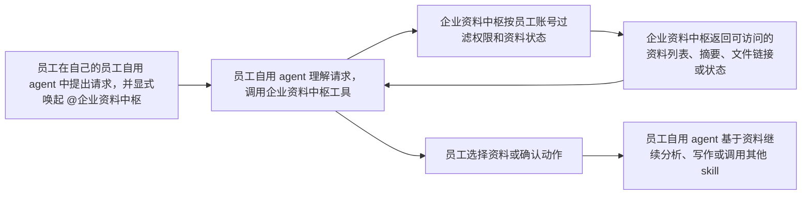
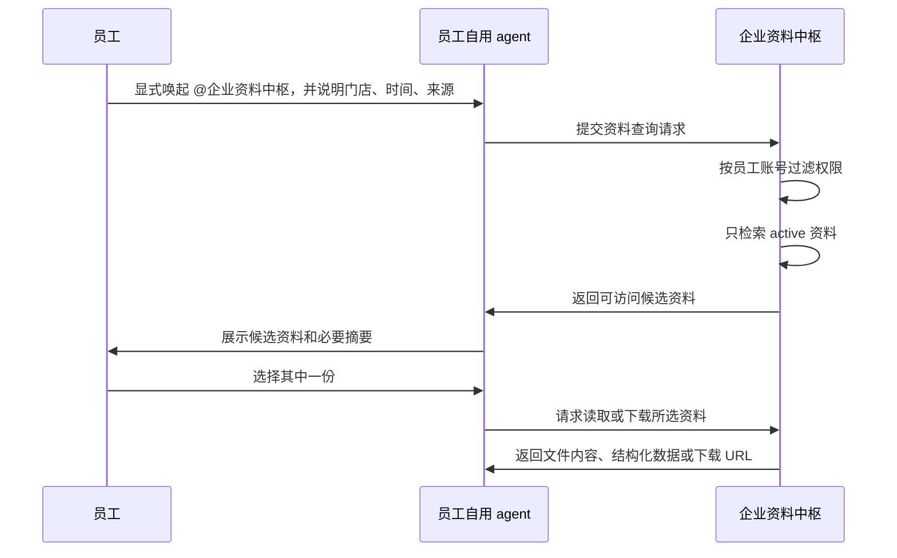
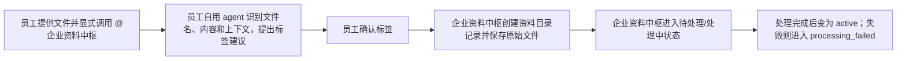

# 企业资料中枢 Use Cases

本文档描述员工使用 Codex、小龙虾、OpenClaw 或其他通用 AI agent 时，如何通过显式工具、skill、plugin 或 MCP 连接企业资料中枢。这里的重点不是“企业资料中枢自己变成一个智能体”，而是说明它如何作为一个服务，给员工自用 agent 提供可信资料、权限过滤、资料目录、状态管理和写回能力。

本文档中的门店、平台和企业名称只是示例。麦家小馆可以作为早期验证或贴近业务的案例，但企业资料中枢本身是通用产品，不专门面向某一家企业。

## 一句话理解

企业资料中枢不是一个直接面向员工聊天的 AI 助手，也不是替大家分析经营的“大系统”。它更像一个可被员工自用 agent 调用的企业资料服务：统一保存资料和分析产物，按员工账号做权限过滤，管理资料状态，提供检索、下载、上传、标签确认、Skill 目录等能力。

员工仍然使用自己熟悉的 AI 工具完成分析、写作和决策。企业资料中枢负责让这些 AI 工具能在被授权的前提下，访问同一套可信资料，而不是每次都靠员工手动拖文件、翻聊天记录或复制网盘链接。

## 使用前提

以下用例默认满足这些前提：

1. 企业已经部署企业资料中枢。
2. 员工在某个员工自用 agent 环境里安装或启用了连接能力，例如 `@企业资料中枢`、MCP server、plugin、connector 或 CLI。
3. 员工已经用自己的员工账号完成授权。
4. 员工自用 agent 调用企业资料中枢时继承员工账号权限，不拥有独立资料权限。
5. 如果员工没有显式唤起或配置连接能力，员工自用 agent 不应假设自己能访问企业资料中枢。

`@企业资料中枢` 只是本文档里的示例名称，真实产品里可能表现为 MCP 工具名、插件名、skill 名或命令名。

## 职责边界

| 角色 | 负责什么 | 不负责什么 |
|---|---|---|
| 员工 | 在自己的员工自用 agent 里显式唤起 `@企业资料中枢`，确认标签、选择文件、判断分析结论 | 不需要记住文件路径、对象存储地址或权限规则 |
| 员工自用 agent | 理解员工意图，调用 `@企业资料中枢`，把返回结果整理给员工，基于已获得资料继续分析或写作 | 不自行绕过权限，不替企业资料中枢判断资料是否可见，不自动拥有企业资料 |
| 企业资料中枢 | 保存资料目录和文件位置，执行权限过滤和状态过滤，返回可访问资料，管理上传、归档、审计和 Skill 目录 | 不直接生成周报、PPT 或经营建议，不运行员工本地 skill，不替员工决定分享范围 |

## 默认交互模型

这条链路里，权限过滤、资料状态判断、目录排序、下载 URL、归档状态、处理失败状态都属于企业资料中枢的职责。员工自用 agent 只是调用服务、解释结果、继续完成员工要求的工作。

## 常见使用方式

| 场景 | 员工显式说法 | 员工自用 agent 做什么 | 企业资料中枢做什么 |
|---|---|---|---|
| 找经营数据 | “`@企业资料中枢` 找保利店上周的美团数据” | 把门店、时间、来源转成查询请求，展示返回结果 | 只在员工有权限且 active 的资料中检索，返回候选资料 |
| 读取文件继续分析 | “用刚才选的那份表，帮我看销售趋势” | 读取员工选择的文件，做分析和解释 | 生成有权限的下载地址或结构化查询结果 |
| 上传新资料 | “`@企业资料中枢` 把这份美团导出表存进去” | 提交文件和标签建议，等待员工确认 | 创建资料目录记录、保存文件、进入处理流程 |
| 查看上传状态 | “`@企业资料中枢` 看一下我刚上传的表好了没” | 调用状态查询并转述结果 | 返回待处理、处理中、active 或失败状态 |
| 写回分析产物 | “把这份周报也放回 `@企业资料中枢`” | 上传报告文件，提交标签建议 | 保存分析产物，记录来源和上传者，处理后进入 active |
| 查询可用能力 | “`@企业资料中枢` 现在公司有哪些菜单分析 skill？” | 展示 Skill 目录返回的名称、用途和使用方式 | 返回 approved skill 清单、版本和获取说明 |
| 分享给同事 | “`@企业资料中枢` 这份报告给李杰也能看” | 提交分享范围变更请求，必要时要求员工确认 | 校验权限，增加李杰个人标签，记录审计 |
| 归档错误资料 | “`@企业资料中枢` 这份表下载错了，不要再让大家用了” | 找到候选资料并要求确认归档对象 | 将资料目录记录改为归档，退出普通检索 |

## Use Case 1：显式查找资料

**用户**

> `@企业资料中枢` 帮我找一下保利店上周的经营数据，最好是美团导出的那份。

**流程**

**职责拆分**

| 动作 | 负责方 |
|---|---|
| 理解“保利店、上周、美团导出”这些自然语言条件 | 员工自用 agent |
| 执行权限过滤，确保无权限资料不暴露存在性 | 企业资料中枢 |
| 只返回 active 资料，排除待处理、失败和归档资料 | 企业资料中枢 |
| 把候选资料解释给员工看 | 员工自用 agent |
| 基于员工选择的资料继续分析 | 员工自用 agent |

**对员工的价值**

员工不用知道文件在哪个群、谁电脑里、对象存储路径是什么。只要在自己的员工自用 agent 里显式调用 `@企业资料中枢`，就能在权限范围内找资料。

## Use Case 2：找不到资料时指导下一步

**用户**

> `@企业资料中枢` 帮我找保利店 6 月会员消费数据。

**流程**

1. 员工自用 agent 调用企业资料中枢查询资料。
2. 企业资料中枢按员工账号过滤权限，并在 active 资料里检索。
3. 如果没有命中，企业资料中枢返回“没有可访问结果”，不返回无权限资料数量或文件名。
4. 员工自用 agent 向员工解释：当前没有找到可访问资料，并建议从对应后台下载后上传。

**重要边界**

“找不到”可能有三种原因：资料确实不存在、资料还没处理完成、员工没有权限。普通员工查询时不应区分这些原因，以免泄露无权限资料的存在性。

## Use Case 3：上传资料并进入处理流程

**用户**

> `@企业资料中枢` 这是刚下载的保利店 6 月美团数据，帮我存进去。

**流程**

**职责拆分**

| 动作 | 负责方 |
|---|---|
| 根据文件名和上下文建议“保利店”“美团数据”“6 月”等标签 | 员工自用 agent，可以辅助推荐 |
| 确认标签是否写入 | 员工，或企业定义的受信确认流程 |
| 创建资料目录记录、保存原始文件、记录上传者 | 企业资料中枢 |
| 解析、切片、向量化、结构化处理和状态更新 | 企业资料中枢及其处理 worker |
| 决定何时进入普通查询范围 | 企业资料中枢 |

**对员工的价值**

员工不用维护复杂目录，但也不是 AI agent 自动授权。标签写入必须来自已有标签清单，并经过确认。

## Use Case 4：查看上传资料状态

**用户**

> `@企业资料中枢` 我刚才上传的那张表为什么还搜不到？

**流程**

1. 员工自用 agent 调用企业资料中枢查询员工最近上传资料。
2. 企业资料中枢返回该资料的状态，例如待处理、处理中、active 或处理失败。
3. 员工自用 agent 把状态解释给员工。

**可能回答**

> 这份资料还在处理中。企业资料中枢只有在必要处理完成后，才会让它进入普通查询和检索，避免后续分析拿到半成品数据。

这里的状态判断来自企业资料中枢，不是员工自用 agent 自己猜的。

## Use Case 5：生成门店周报

**用户**

> `@企业资料中枢` 找保利店上周经营数据和评价数据。找到后，我想让你帮我生成一份周报。

**流程**

1. 员工自用 agent 先调用企业资料中枢找资料。
2. 企业资料中枢返回员工可访问的经营数据、评价数据、历史周报等候选资料。
3. 员工选择要使用的资料，或授权员工自用 agent 使用返回的最相关资料。
4. 员工自用 agent 读取资料并生成周报。
5. 如果员工希望沉淀结果，员工自用 agent 再显式调用企业资料中枢上传周报。
6. 企业资料中枢把周报作为分析产物保存、打标签、进入处理流程。

**职责拆分**

| 动作 | 负责方 |
|---|---|
| 找资料、过滤权限、返回候选 | 企业资料中枢 |
| 生成周报文字、图表解释和行动建议 | 员工自用 agent 或其他业务 skill |
| 保存最终周报产物 | 企业资料中枢 |

企业资料中枢不自己生成周报。它只提供资料、保存结果，并让后续有权限的人能复用。

## Use Case 6：查询可用业务 skill

**用户**

> `@企业资料中枢` 现在公司有哪些菜单分析相关 skill？我想看最近三个月菜品毛利。

**流程**

1. 员工自用 agent 调用企业资料中枢的 Skill 目录查询能力。
2. 企业资料中枢返回 approved skill 清单、适用场景、版本、获取方式和使用示例。
3. 员工自用 agent 把这些信息展示给员工。
4. 员工决定是否在自己的员工自用 agent 环境里安装或调用对应 skill。
5. 如果要运行分析，员工自用 agent 再调用企业资料中枢查找所需输入资料。

**重要边界**

Skill 目录不是 skill 执行平台。企业资料中枢可以告诉员工“有哪些 approved skill、怎么获取、需要什么输入”，但不负责在自己内部运行菜单分析、经营诊断或周报生成。

## Use Case 7：把分析产物分享给指定同事

**用户**

> `@企业资料中枢` 这份保利店菜单分析报告也给李杰看一下。

**流程**

1. 员工自用 agent 根据当前上下文或员工描述定位候选报告。
2. 企业资料中枢返回员工可访问且可操作的候选资料。
3. 员工确认要分享哪一份。
4. 企业资料中枢校验当前员工是否允许修改标签。
5. 企业资料中枢给资料增加“李杰”的个人标签，并记录审计日志。
6. 员工自用 agent 告诉员工：李杰之后可以通过自己的员工自用 agent 显式调用 `@企业资料中枢` 找到这份报告。

**重要边界**

员工自用 agent 可以发起分享请求，但不能自行决定资料应该给谁看。真正的标签变更、权限校验和审计记录由企业资料中枢完成。

## Use Case 8：保护无权限资料

**用户**

> `@企业资料中枢` 帮我找苏州街店上个月的绩效资料。

**流程**

1. 员工自用 agent 提交查询请求。
2. 企业资料中枢先按当前员工账号做权限过滤。
3. 如果员工没有苏州街店相关标签，也没有个人分享标签或全员可见标签，企业资料中枢返回空结果。
4. 员工自用 agent 只能转述“没有找到你可访问的相关资料”。

**禁止行为**

- 不说“有资料但你无权查看”。
- 不暴露无权限资料数量。
- 不暴露无权限资料标题、文件名、上传者或摘要。
- 不让员工自用 agent 自己根据返回错误推测资料是否存在。

## Use Case 9：沉淀会议纪要和管理知识

**用户**

> 这是今天运营会纪要。`@企业资料中枢` 帮我存进去，之后大家问差评处理话术时能搜到。

**流程**

1. 员工自用 agent 可以先帮助员工整理会议纪要文本。
2. 员工自用 agent 提出资料类型和标签建议，例如“管理知识”“全员可见”或指定管理层标签。
3. 员工确认标签和可见范围。
4. 企业资料中枢保存会议纪要，记录上传者和来源，进入处理流程。
5. 处理完成后，后续有权限的员工可以通过自己的员工自用 agent 显式调用 `@企业资料中枢` 检索到这份纪要。

**职责拆分**

整理纪要是员工自用 agent 的工作；保存、权限、状态、审计和后续检索是企业资料中枢的工作。

## Use Case 10：记录经营事件

**用户**

> `@企业资料中枢` 记一下，保利店 6 月 12 日到 6 月 16 日装修，营业额下降不要直接算经营问题。

**流程**

1. 员工自用 agent 把这句话整理成结构化经营事件草稿。
2. 员工确认门店、时间、事件类型和描述。
3. 企业资料中枢保存经营事件并打上对应标签。
4. 后续员工自用 agent 做周报、月报或异常分析时，可以显式查询相关经营事件作为解释线索。

企业资料中枢保存事实，不直接给出经营建议。

## Use Case 11：归档错误资料

**用户**

> `@企业资料中枢` 这份表下载错了，不要再让大家用了。

**流程**

1. 员工自用 agent 根据当前上下文或员工描述查找候选资料。
2. 企业资料中枢返回员工可访问且可操作的候选资料。
3. 员工确认要归档哪一份。
4. 企业资料中枢把资料目录记录标记为归档。
5. 企业资料中枢让该资料及其派生索引退出普通查询和智能体检索。
6. 原始文件仍保留在对象存储中，管理员以后可以追溯。

**重要边界**

归档不是物理删除。员工自用 agent 不能直接删除对象存储里的文件。

## Use Case 12：跨 AI 工具继续工作

**用户**

> 我昨天用小龙虾生成了一份保利店周报，并放进了 `@企业资料中枢`。今天我想用 Codex 继续改成 PPT。

**流程**

1. 员工在 Codex 中显式调用 `@企业资料中枢` 查找昨天的周报。
2. 企业资料中枢按 Codex 当前绑定的员工账号做权限过滤，返回可访问的周报。
3. Codex 读取员工选择的周报。
4. Codex 帮员工改写成 PPT 提纲或演示材料。
5. 员工确认后，Codex 再调用 `@企业资料中枢` 把新 PPT 上传为分析产物。

**对员工的价值**

不同 AI 工具不需要共享内部记忆。只要资料和产物都回到企业资料中枢，员工就可以在不同工具之间接着工作。

## Use Case 13：管理员处理失败资料

**管理员**

> `@企业资料中枢` 看一下最近有没有上传失败或处理失败的资料。

**流程**

1. 管理员通过后台、CLI 或自己的员工自用 agent 显式调用企业资料中枢。
2. 企业资料中枢校验管理员权限。
3. 企业资料中枢列出处理失败资料、失败原因摘要、最后失败时间和重试次数。
4. 管理员决定重新处理、补标签、归档或联系上传者。

**重要边界**

失败资料默认不进入普通员工查询范围。管理员处理失败资料是运维和治理动作，不是普通员工知识库搜索。

## 哪些事情不由企业资料中枢直接做

为了避免误解，企业资料中枢第一阶段不直接做这些事：

- 不作为直接面向员工的聊天智能体。
- 不替员工自动做复杂经营分析。
- 不自己生成周报、PPT 或 dashboard。
- 不运行菜单分析、经营诊断等 skill。
- 不替员工决定资料该给谁看。
- 不绕过第三方平台直接拿数据库。
- 不依赖员工自用 agent 自己做权限过滤。

这些事情仍然由员工手里的自用 agent、业务 skill、第三方系统或未来独立服务完成。企业资料中枢的任务是把资料、结果、标签、状态、审计和可用能力统一管理好，并以服务形式提供给这些工具调用。

## 最有价值的日常收益

1. 员工不用到处找文件。
2. 员工自用 agent 可以在授权范围内调用统一资料服务，而不是每次从零开始。
3. 报告和分析结果能沉淀复用。
4. 不同 AI 工具可以围绕同一套资料协作。
5. 资料分享更清楚，不靠反复转发文件。
6. 离职、调岗、交接时资料不丢。
7. 管理层经验、会议结论、操作 SOP 能持续积累。
8. 员工只看到自己该看的资料，减少误看和误传。
